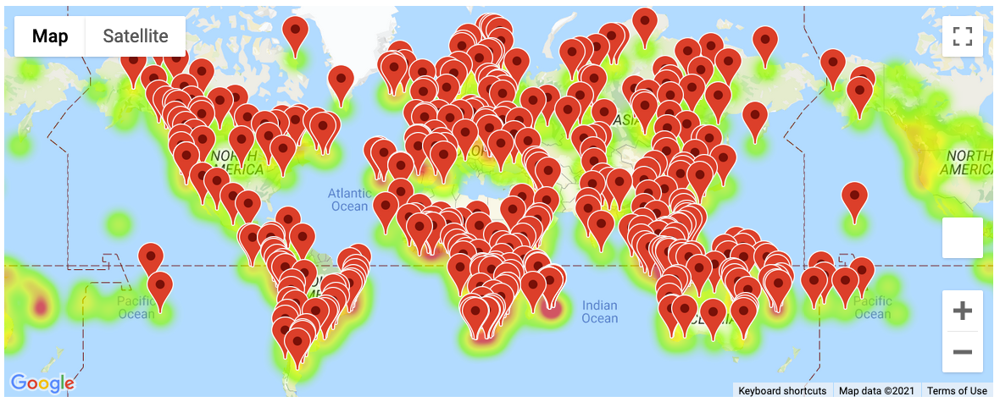
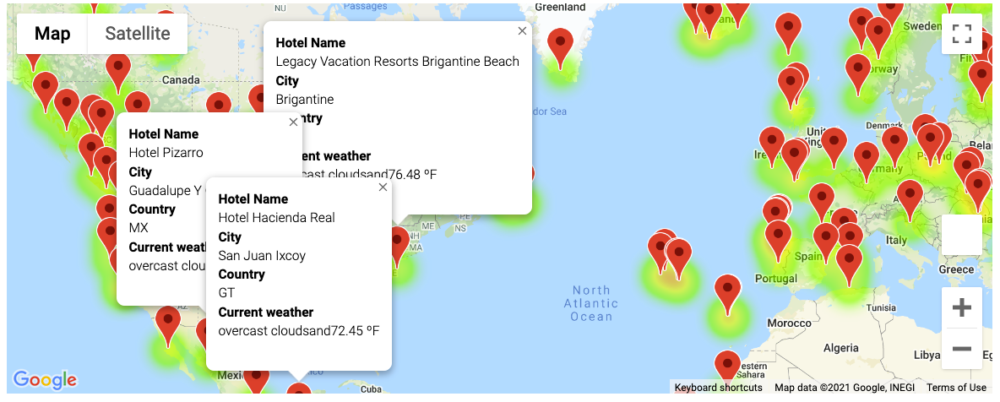
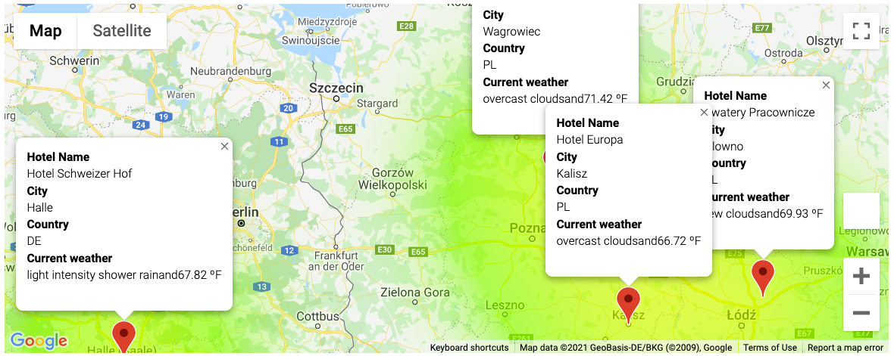

# Vacations coding

# # Weather Database
_____________________________

# # # Creating the dataframe

For the trip application we were requested to add some weather descriptions as well as the road trip.

With some latitude / longitude criteria we identified 2,000 potential destination points to travel to. Those were extracted into a CSV file with the aim of analyzing them later in the process and present different offers to the customer.

In the image we can review the headers with information about:
- City
- Latitude
- Longitude
- Max Temperatures
- Humidity
- Cloudiness
- Wind Speed
- Country
- Description

With that information now we will be exploding the information to get the additional data.

_____________________________

# # Vacation Search

Observing some criteria we looked for specific weather temperature to satisfy the customer requirements. identifying at the same time some cities to be recommended.

The information was displayed with the help of Google Maps by invocking an API to exchange information with Google and the program.

The challenge in this part is to get the API ready and correctly setted up. Once the API_key was loaded and the code was created the next step was to display the information of the points including Hotels and weather descriptions, as we can see in the following image

To finish this part the customer requested specific cities within a temperature range, and the code purpose was to satisfy the customer preferences on that.

_________________________________

# # Vacation Itinerary

Now that we know the customer temperature preferences we are requested to display an itinerary with four cities that comply with the criteria. 
In this case the customer will travel by car, so the cities are close enough to have a good experience driving and enjoying the trip.

To end the code, the program is now displaying the best route to get from each city and the data related.

_________________________________

#  Conclusions

Coding this part can be enriched with the combination of other criteria, such as: 'restaurant_recommendations', 'Interest_points_to_visit', 'main_city_events', etc.

The use of API's gathering information from other sources is a very good way to complement the own service and coding.
